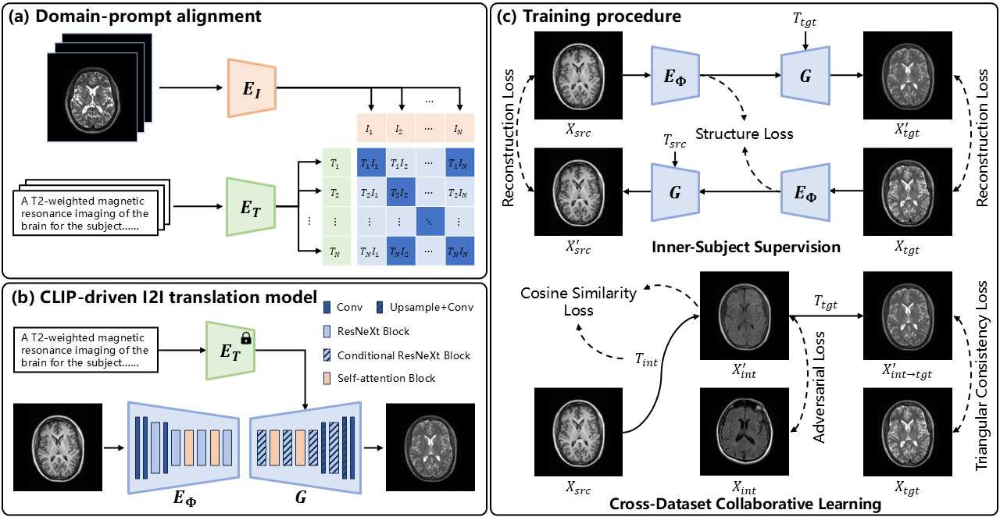
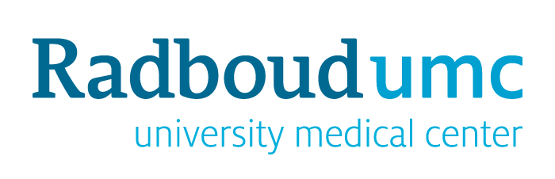
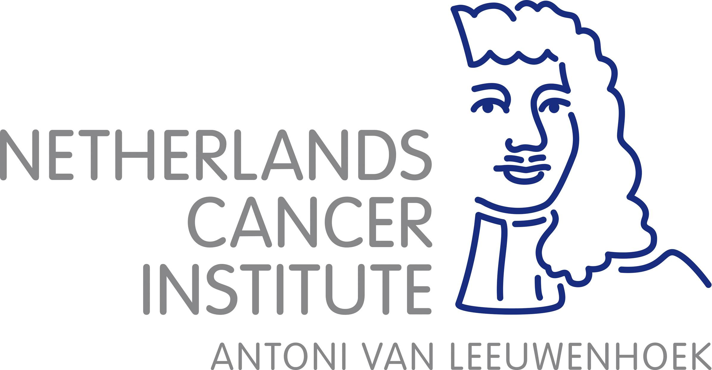

# Virtual sequence: all in one medical image-to-image translation
In this work, we propose the "EVery domain All at once" image-to-image (EVA-I2I) translation model, which uses contrastive language-image pre-training (CLIP) to learn and represent various domains and further designs prompts to drive I2I translation.
The CLIP encoding maps natural language descriptions of scans into a common latent space that contains denser semantics than one-hot encoding in most existing methods.

## <span id = "approach">Approach</span>
<p align="center">

</p>

## Training
- Pretrain CLIP
```sh
python src/eva/pretrain_clip.py \
    -cd config/eva/dataset.yaml \
    -cm config/eva/eva.yaml \
    -ct config/eva/train.yaml
```
- Initialize and finetune EVA-I2I with both paired and unpaired samples
```sh
python src/eva/pretrain_eva.py \
    -cd config/eva/dataset.yaml \
    -cm config/eva/eva.yaml \
    -ct config/eva/train.yaml \
    -lg ckpt/eva/pretrain_clip/ckpt_best.pth \
    -sd 5
```

## <span id = "acknowledgements">Acknowledgements</span>




## <span id = "contact">Contact</span>
For any code-related problems or questions please [open an issue](https://github.com/fiy2W/mri_seq2seq/issues/new) or concat us by emails.

- [Ritse.Mann@radboudumc.nl](mailto:Ritse.Mann@radboudumc.nl) (Ritse Mann)
- [taotan@mpu.edu.mo](mailto:taotan@mpu.edu.mo) (Tao Tan)
- [Luyi.Han@radboudumc.nl](mailto:Luyi.Han@radboudumc.nl) (Luyi Han)